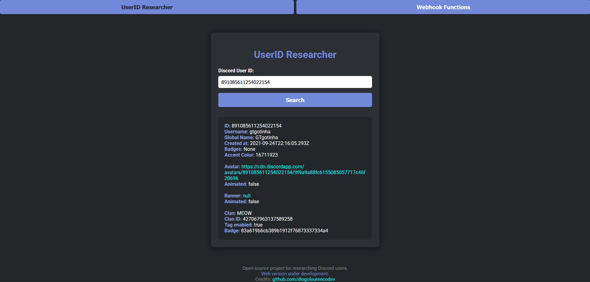
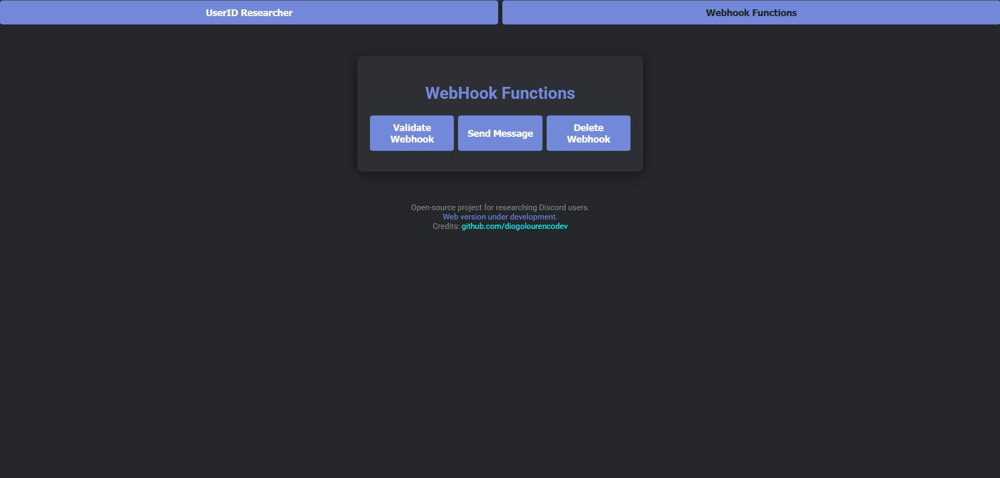
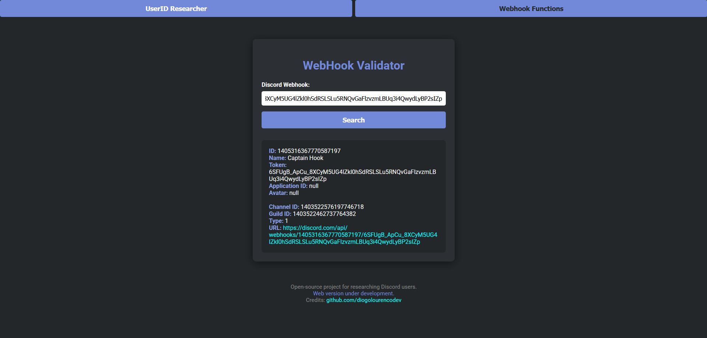
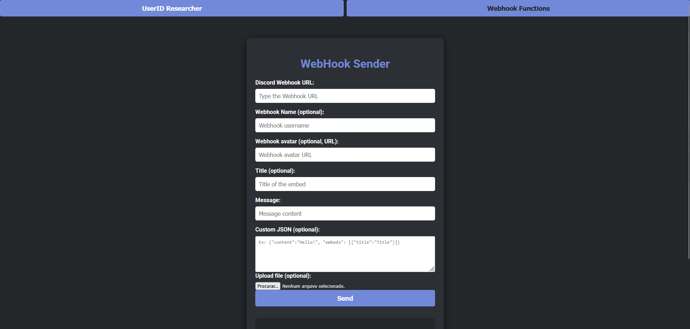
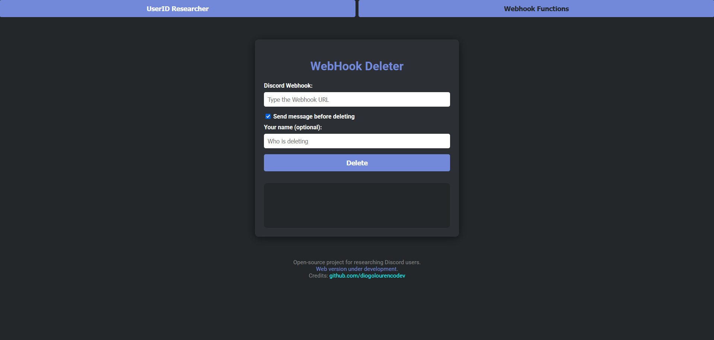

# Discord Researcher Tools

A comprehensive web-based utility suite for Discord research and management, featuring three powerful modules: UserID Researcher, Webhook Functions, and Guild Functions. This tool provides an intuitive interface for Discord community managers, researchers, and developers to efficiently gather and analyze Discord data.







## 🚀 Features

### 1. UserID Researcher
Look up comprehensive Discord user information using any valid Discord User ID.

**Displays:**
- **User Details**: Username, global name, and account creation date
- **Visual Assets**: Avatar and banner information with direct links
- **Profile Data**: Badges, accent color, and clan information
- **Guild Info**: Primary guild/clan details including tag and badge

### 2. Webhook Functions
Complete webhook management toolkit with three distinct operations:

#### Webhook Validator
- Verify webhook existence and validity
- View detailed webhook information including:
  - Webhook ID, name, and token
  - Associated channel and guild details
  - Avatar and application information

#### Webhook Sender
- Send messages through Discord webhooks with advanced options:
  - Custom webhook username and avatar
  - Rich embeds with titles and descriptions
  - Custom JSON payload support
  - File attachment capabilities
  - Real-time preview and testing

#### Webhook Deleter
- Delete webhooks with optional notification features:
  - Send customizable deletion messages
  - Optional deleter attribution
  - Confirmation before permanent deletion

### 3. Guild Functions
Advanced guild/invite analysis tools:

#### Invite Validator
- Validate Discord server invitations
- Comprehensive guild information including:
  - Server name, description, and member count
  - Boost level and verification status
  - Icon and banner assets
  - Channel and invite details
  - Inviter profile information

## 🛠️ Technology Stack

- **Frontend**: Pure HTML5, CSS3, JavaScript (ES6+)
- **Styling**: Modern CSS with responsive design
- **APIs**: Discord API and DiscordLookup API
- **Fonts**: Google Fonts (Roboto)
- **Icons**: Font Awesome integration
- **No Dependencies**: Zero external libraries required

## 📋 Prerequisites

- Modern web browser (Chrome 80+, Firefox 75+, Safari 13+, Edge 80+)
- JavaScript enabled
- Internet connection for API calls
- No installation or server setup required

## 🚦 Quick Start

### Method 1: Direct Browser
1. Download or clone the repository
2. Open `index.html` in any modern web browser
3. Start using immediately!

### Method 2: Open on Your Browser
```bash
https://discord-researcher.vercel.app/
```

## 🎯 Usage Guide

### UserID Researcher
1. Click "UserID Researcher" in the navigation
2. Enter a Discord User ID (e.g., `123456789012345678`)
3. Click "Search" to retrieve comprehensive user information
4. Review all available data including avatars, banners, and guild info

### Webhook Functions
1. Click "Webhook Functions" in the navigation
2. Choose your desired operation:
   - **Validate**: Check webhook validity and view details
   - **Send**: Post messages through webhooks
   - **Delete**: Remove webhooks with optional notifications
3. Fill in the required information
4. Execute the operation and review results

### Guild Functions
1. Click "Guild Functions" in the navigation
2. Use "Validate Invitation" to analyze Discord server invites
3. Enter a Discord invite code (e.g., `abc123` or full URL)
4. View comprehensive guild and inviter information

## 🔧 Configuration

The application includes several customization options:

- **Responsive Design**: Automatically adapts to desktop and mobile
- **Theme Support**: Clean dark theme optimized for Discord aesthetics
- **Error Handling**: Comprehensive error messages for invalid inputs
- **Loading States**: Clear feedback during API operations
- **Validation**: Real-time input validation and formatting

## 📁 Project Structure

```
discord-userid-researcher/
├── index.html              # Main application interface
├── script.js               # Core JavaScript functionality
├── assets/                 # Screenshots and documentation images
│   ├── image.png          # UserID Researcher screenshot
│   ├── image2.png         # Webhook Functions screenshot
│   ├── image3.png         # Guild Functions screenshot
│   ├── image4.png         # Webhook sender interface
│   └── image5.png         # Settings and configuration
├── README.md              # This documentation
└── .gitignore            # Git ignore rules
```

## 🔍 API Information

This tool utilizes the following APIs:

- **DiscordLookup API**: `https://discordlookup.mesalytic.moe/v1/user/{user_id}`
- **Discord API**: Native Discord endpoints for webhook and invite operations
- **CDN Endpoints**: Discord's content delivery network for avatars and banners

## ⚖️ Legal & Usage Notes

- **Terms of Service**: Please respect Discord's Terms of Service and Community Guidelines
- **Rate Limits**: Be mindful of Discord API rate limits
- **Privacy**: No data is stored or transmitted beyond what's necessary for API calls
- **Educational Purpose**: Designed for legitimate Discord research and management

## 🤝 Contributing

Contributions are welcome! Please feel free to:
- Report bugs via GitHub Issues
- Submit pull requests for improvements
- Suggest new features or enhancements
- Share feedback and usage experiences

## 📞 Support

For support, questions, or suggestions:
- Open an issue on GitHub
- Contact: [Diogo Lourenço](https://github.com/diogolourencodev)

## 📄 License

This project is open source and available under the [MIT License](LICENSE).

---

**Note:** This tool is intended for legitimate use with Discord accounts and webhooks you own or have explicit permission to research/manage. Always respect user privacy and Discord's Terms of Service.

